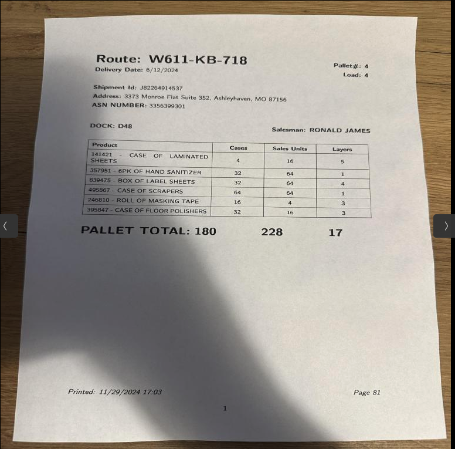
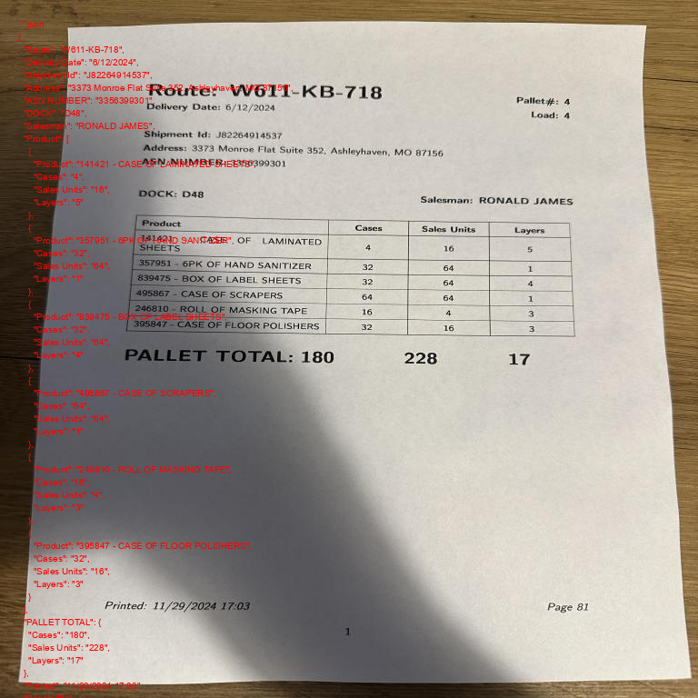
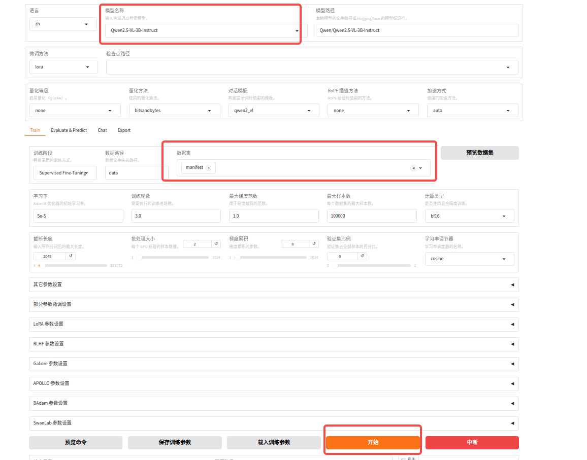
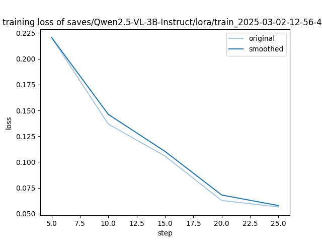
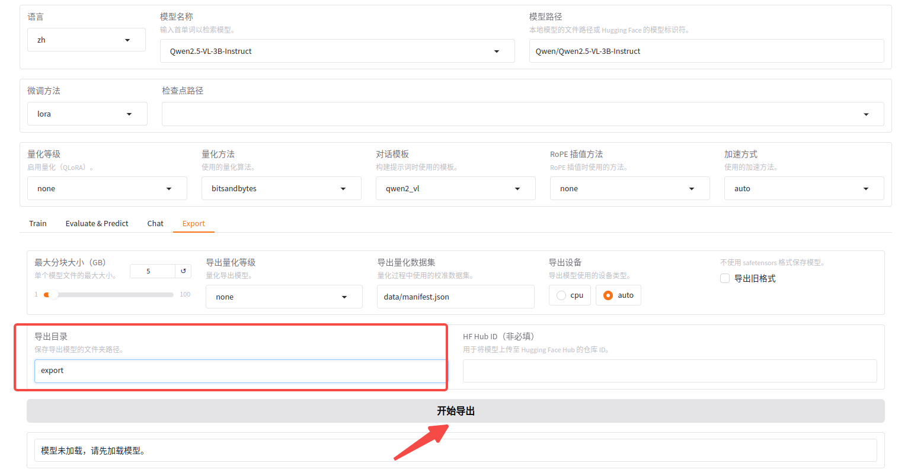
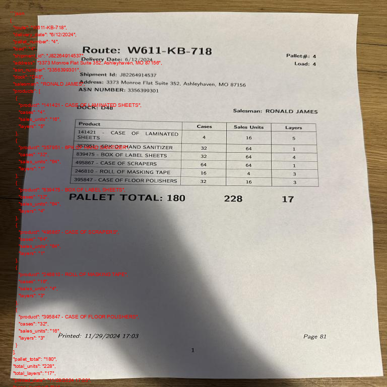

最近周末在家学习VLM大模型, 记录下自己的学习过程。

* 模型部署
* 模型微调 & 导出
* 部署微调模型

本文以OCR任务为例，识别图片中的文字并以json格式输出。



# 1 模型部署
## Ollama vs vllm

ollama 是一个开源框架，专为在本地机器上便捷部署和运行大型语言模型（LLM）而设计。
vLLM是一个专注于高性能LLM推理的工具，能够有效地利用多核CPU和GPU资源，显著提升LLM的推理速度。

总体感觉ollama的安装和部署更加简单， 而vllm在推理速度上更有优势。
ollama对VLM多模态大模型的支持非常少，比如不支持常用的Qwen VL系列。

这里选择Qwen2.5-VL进行部署和微调，因此选择vllm进行部署。

## Qwen2.5-VL 模型部署和测试
环境安装
```
conda create -n Qwen2.5 python=3.11 -y
conda activate Qwen2.5
pip install vllm
pip install git+https://github.com/huggingface/transformers
pip install torch accelerate
```

启动Qwen2.5-VL

```
conda activate Qwen2.5
vllm serve Qwen/Qwen2.5-VL-3B-Instruct
```

如果要启动7B的模型，需要指定一些参数，否则显存不足。
```
vllm serve Qwen/Qwen2.5-VL-7B-Instruct --gpu-memory-utilization 0.9 --max-model-len 8192 --limit-mm-per-prompt "image=2"
```

使用openai api进行测试
```
python vllm_local_api.py
```




# 2 模型微调 & 导出
目前常用的微调工具包:
* huggingface transformers
* llama-factory
* unsloth
* ms-swift

使用huggingface transformers进行微调扩展性最强，但是通用性太差，每换一个模型都要重新写一套代码，个人不建议这么用。想试试可以参考https://github.com/roboflow/notebooks/blob/main/notebooks/how-to-finetune-qwen2-5-vl-for-json-data-extraction.ipynb

llama-factory、unsloth、ms-swift都是有图形界面的，使用webUI可以轻松完成微调任务的设置，保存配置后下次也可脚本运行。忽略繁琐的参数设置，可以把重心放到数据上。我个人比较喜欢llama-factory。


### llama-factory 环境安装
```
conda create -n llama-factory python=3.11 -y
git clone --depth 1 https://github.com/hiyouga/LLaMA-Factory.git
cd LLaMA-Factory
pip install -e ".[torch,metrics]"
```

### 数据准备
llama-factory支持两种数据格式， alpaca和sharegpt格式。

首先下载数据 https://universe.roboflow.com/peter-robicheaux/pallet-load-manifest-json-2/dataset/18
```
{"image":"IMG_3128_jpg.rf.050d52dec36d353a43a9eba664c28ad3.jpg","prefix":"<JSON>","suffix":"{\"route\": \"D452-SU-275\",\"pallet_number\": \"15\",\"delivery_date\": \"1/11/2024\",\"load\": \"1\",\"dock\": \"D05\",\"shipment_id\": \"K77912144793\",\"destination\": \"82135 Robert Harbors Apt. 285, Marquezhaven, AZ 68208\",\"asn_number\": \"1338742991\",\"salesman\": \"KIMBERLY GARCIA\",\"products\": [{\"description\": \"223606 - CASE OF MICROFIBER SPONGES\",\"cases\": \"4\",\"sales_units\": \"4\",\"layers\": \"5\"},{\"description\": \"728495 - BOX OF STAIN REMOVERS\",\"cases\": \"64\",\"sales_units\": \"2\",\"layers\": \"4\"},{\"description\": \"112233 - CASE OF DISH SOAP\",\"cases\": \"8\",\"sales_units\": \"2\",\"layers\": \"1\"},{\"description\": \"847395 - CASE OF SQUEEGEES\",\"cases\": \"4\",\"sales_units\": \"32\",\"layers\": \"1\"},{\"description\": \"963741 - 12PK OF DISINFECTANT WIPES\",\"cases\": \"8\",\"sales_units\": \"2\",\"layers\": \"2\"},{\"description\": \"258963 - CASE OF MULTI-SURFACE SPRAY\",\"cases\": \"32\",\"sales_units\": \"32\",\"layers\": \"4\"}],\"total_cases\": \"120\",\"total_units\": \"74\",\"total_layers\": \"17\",\"printed_date\": \"12/05/2024 11:29\",\"page_number\": \"59\"}"}
```

train/annotations.jsonl文件中每条都是这种json格式，需要写个脚本转化为sharegpt格式，完整代码参考convert2sharegpt.py

```
def format_data(image_dir, entry):
    SYSTEM_MESSAGE = """You are a Vision Language Model specialized in extracting structured data from visual representations of palette manifests.
Your task is to analyze the provided image of a palette manifest and extract the relevant information into a well-structured JSON format.
The palette manifest includes details such as item names, quantities, dimensions, weights, and other attributes.
Focus on identifying key data fields and ensuring the output adheres to the requested JSON structure.
Provide only the JSON output based on the extracted information. Avoid additional explanations or comments."""

    question = 'extract data in JSON format'
    answer = entry["suffix"]
    image_path = image_dir + "/" + entry["image"]

    message = {
        "id": entry["image"],
        "image": image_path,
        "conversations": [
            {
                "from": "human",
                "value": "<image>\n" + question
            },
            {
                "from": "gpt",
                "value": answer
            },
        ],
        "system": SYSTEM_MESSAGE,
    }
    return message
```

转换之后效果:
```
[
    {
        "id": "IMG_3128_jpg.rf.050d52dec36d353a43a9eba664c28ad3.jpg",
        "image": "/home/libing/dataset/pallet-load-manifest-json-2/train//IMG_3128_jpg.rf.050d52dec36d353a43a9eba664c28ad3.jpg",
        "conversations": [
            {
                "from": "human",
                "value": "<image>\nextract data in JSON format"
            },
            {
                "from": "gpt",
                "value": "{\"route\": \"D452-SU-275\",\"pallet_number\": \"15\",\"delivery_date\": \"1/11/2024\",\"load\": \"1\",\"dock\": \"D05\",\"shipment_id\": \"K77912144793\",\"destination\": \"82135 Robert Harbors Apt. 285, Marquezhaven, AZ 68208\",\"asn_number\": \"1338742991\",\"salesman\": \"KIMBERLY GARCIA\",\"products\": [{\"description\": \"223606 - CASE OF MICROFIBER SPONGES\",\"cases\": \"4\",\"sales_units\": \"4\",\"layers\": \"5\"},{\"description\": \"728495 - BOX OF STAIN REMOVERS\",\"cases\": \"64\",\"sales_units\": \"2\",\"layers\": \"4\"},{\"description\": \"112233 - CASE OF DISH SOAP\",\"cases\": \"8\",\"sales_units\": \"2\",\"layers\": \"1\"},{\"description\": \"847395 - CASE OF SQUEEGEES\",\"cases\": \"4\",\"sales_units\": \"32\",\"layers\": \"1\"},{\"description\": \"963741 - 12PK OF DISINFECTANT WIPES\",\"cases\": \"8\",\"sales_units\": \"2\",\"layers\": \"2\"},{\"description\": \"258963 - CASE OF MULTI-SURFACE SPRAY\",\"cases\": \"32\",\"sales_units\": \"32\",\"layers\": \"4\"}],\"total_cases\": \"120\",\"total_units\": \"74\",\"total_layers\": \"17\",\"printed_date\": \"12/05/2024 11:29\",\"page_number\": \"59\"}"
            }
        ],
        "system": "You are a Vision Language Model specialized in extracting structured data from visual representations of palette manifests.\nYour task is to analyze the provided image of a palette manifest and extract the relevant information into a well-structured JSON format.\nThe palette manifest includes details such as item names, quantities, dimensions, weights, and other attributes.\nFocus on identifying key data fields and ensuring the output adheres to the requested JSON structure.\nProvide only the JSON output based on the extracted information. Avoid additional explanations or comments."
    },
```

转换的得来的manifest.json文件放到LLaMa-Factory/data/目录，LLaMa-Factory/data/data_info.json文件中增加pallet-load-manifest的信息
```
  "manifest": {
    "file_name": "manifest.json",
    "formatting": "sharegpt",
    "columns": {
      "messages": "conversations",
      "images": "image"
    },
    "tags": {
      "role_tag": "from",
      "content_tag": "value",
      "user_tag": "human",
      "assistant_tag": "gpt"
    }
  }
```


### 模型微调
GUI方式启动llama-factory

```
conda activate llama-factory
llamafactory-cli webui
```




### 导出


模型导出后目录如下:

```
├── added_tokens.json
├── chat_template.json
├── config.json
├── generation_config.json
├── merges.txt
├── model-00001-of-00002.safetensors
├── model-00002-of-00002.safetensors
├── Modelfile
├── model.safetensors.index.json
├── preprocessor_config.json
├── special_tokens_map.json
├── tokenizer_config.json
├── tokenizer.json
└── vocab.json

```


## 部署微调模型
vllm可以指定model_path的方式直接加载llama-factory导出的模型

```
conda activate Qwen2.5
cd LLaMa-Factory
vllm serve export
```

使用openai api进行测试，记得把model改下名字，改成export
```
python vllm_local_api.py
```

识别效果:



